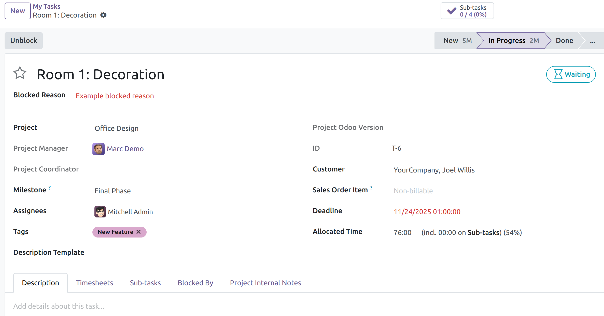

This module allows you to block tasks and provide a reason when a task is blocked.

The blocked reason will be displayed in the form, kanban and list view of the tasks.

Blocking (or unblocking) a task also blocks (or unblocks) their children tasks.

An example of the form view of a task:

Note: Odoo already has a task-blocking feature based on task dependencies that can coexist with the blocking feature provided by this module. On one hand, both blocking features share the same "waiting" state to mark a task as blocked. On the other hand, this module provides a manual task-blocking mechanism, while Odoo blocks tasks if they have unfinished dependencies. If you have this module installed and task dependencies enabled, a task may be blocked for either of these two reasons.
